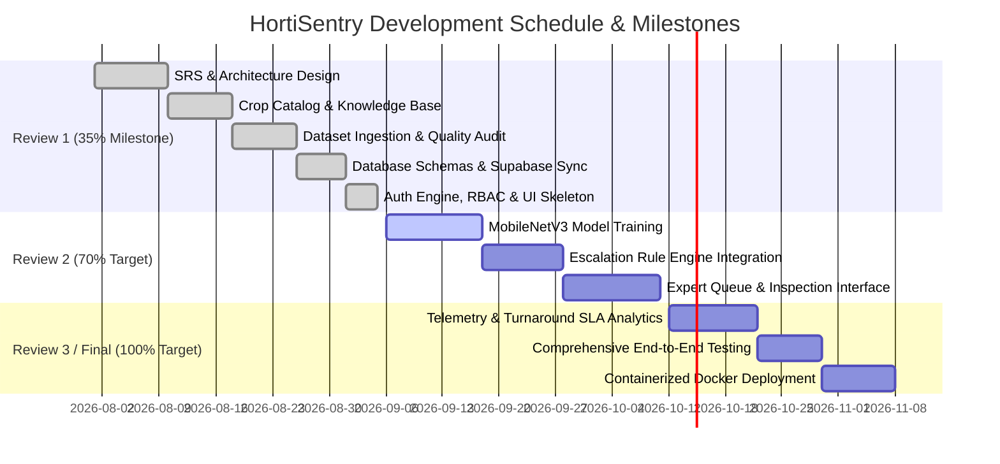

# PROJECT REVIEW 1 EVALUATION REPORT (35% COMPLETION)

**Project Title:** HortiSentry: AI-Assisted Crop Disease Observation & Expert Escalation Platform  
**Domain:** Artificial Intelligence, Computer Vision, Web Engineering, Decision Support Systems  
**Project Category:** Software-Only Web Platform (Zero Hardware / Zero IoT)  
**Milestone:** Review 1 (35% Project Completion Stage)  
**Date:** September 2026  

---

## Executive Summary

HortiSentry is an AI-assisted, software-only decision-support platform designed to bridge the operational gap between grassroots horticultural farmers and agricultural extension specialists. Horticultural farmers frequently detect crop diseases late and lack standardized methods to communicate visual evidence, resulting in delayed specialist intervention. 

HortiSentry addresses this challenge through a multi-tier web platform that combines lightweight deep learning (MobileNetV3), automated image quality auditing (blur and exposure screening), contextual field data collection (phenological stages and visual symptoms), and a human-in-the-loop expert escalation workflow.

At the **Review 1 Milestone (35% Completion)**, the foundational architectural, data engineering, security, and schema infrastructure have been designed, implemented, and verified. Key deliverables completed include:
1. Complete System Requirements Specification (SRS) and 3-tier modular architecture design.
2. Relational database schema with 12 SQLAlchemy ORM entities supporting SQLite and PostgreSQL (Supabase).
3. Dynamic multi-crop knowledge catalog comprising 32 horticultural crops with bilingual metadata (English & Tamil).
4. Image quality auditing and dataset preprocessing pipeline (Laplacian variance blur detection, perceptual hashing, and 70/15/15 stratified splitting across 6,271 curated leaf samples).
5. Secure authentication and Role-Based Access Control (RBAC) engine featuring PBKDF2-HMAC-SHA256 password hashing, stateless JWT tokens, and an administrative verification gate for agricultural experts.
6. Initial front-end user interfaces (Farmer Observation Wizard skeleton, responsive registration with district autocomplete, and role-based portal routing).

---

## 1. Problem Definition & Motivation

### 1.1 The Practical Problem
In horticultural crop cultivation, foliar diseases (such as Early Blight, Late Blight, and Septoria Leaf Spot) can spread rapidly if not mitigated early. Farmers encounter several systemic obstacles:
- **Delayed Reporting:** Visual symptoms are often noticed only after severe defoliation, or reported days later due to geographical distance from agricultural extension centers.
- **Unstructured Records:** Traditional reporting relies on phone descriptions or informal chat applications without standardized visual imagery, phenological stage context, or historical tracking.
- **Specialist Overload & Delayed Review:** Agricultural specialists cannot physically inspect every farm promptly, causing diagnostic bottlenecks.
- **Fragmented Data:** Regional farmer producer organizations (FPOs) and cooperatives lack centralized historical records to track localized pathogen outbreaks.

### 1.2 System Scope & Safeguards
- **Software-Only Architecture:** The system requires no physical hardware sensors, field microcontrollers, external camera rigs, or IoT devices. Farmers access the system via standard mobile or desktop web browsers.
- **Decision Support, Not Diagnostic Certification:** AI model predictions provide probabilistic condition screening and advisory suggestions. They do not replace certified agricultural specialists.
- **Human-in-the-Loop Escalation:** Observations exhibiting low confidence, poor image quality, or high-risk pathogens are automatically escalated to verified agricultural experts for binding human evaluation.

---

## 2. Project Objectives & Primary KPI

### 2.1 Core Objectives
1. Develop an accessible web interface for farmers to submit leaf imagery along with structured field context (crop stage, symptoms, coarse location).
2. Implement automated computer-vision quality checks to filter out blurry or improperly exposed photographs prior to classification.
3. Build a lightweight convolutional neural network (MobileNetV3 Small) to generate initial possible-condition probabilities.
4. Establish an automated escalation engine that routes uncertain or high-risk cases to an expert review queue.
5. Provide a specialized dashboard for verified agricultural specialists to inspect high-resolution imagery and prescribe non-chemical management recommendations.
6. Track turnaround time benchmarks and regional disease distributions through an administrative telemetry portal.

### 2.2 Primary Evaluation KPI: Time to Expert Review (TTER)
The central operational efficiency metric of HortiSentry is the **Time to Expert Review (TTER)**:

$$\text{Time to Expert Review} = t_{\text{resolution}} - t_{\text{first\_symptom}}$$

Where:
- $t_{\text{first\_symptom}}$: Timestamp when the farmer first observed foliage abnormalities.
- $t_{\text{resolution}}$: Timestamp when the verified expert completes and records the diagnosis.

| Benchmark Parameter | Value | Description |
| :--- | :---: | :--- |
| **Traditional Baseline** | **48.0 Hours** | Physical extension visit / manual coordination delay |
| **HortiSentry Target SLA** | **$\le$ 6.0 Hours** | Automated queueing and remote digital inspection SLA |
| **Target Improvement** | **$\ge$ 87.5%** | Turnaround time reduction in expert response |

---

## 3. Literature Survey & Comparative Analysis

| Feature / Dimension | Traditional Extension Services | Generic Plant Identification Apps | HortiSentry Platform (Proposed) |
| :--- | :--- | :--- | :--- |
| **Primary Interaction** | In-person physical visits / phone calls | Black-box mobile consumer apps | Multi-stakeholder web collaboration platform |
| **Hardware Dependencies** | Manual field visits | Smartphone | Standard web browser (Zero IoT/hardware) |
| **Contextual Inputs** | Verbal / subjective | Raw photograph only | Photo + Phenological Stage + Structured Symptoms |
| **Image Quality Verification** | Human subjective check | Rare / unhandled | Automated Laplacian blur & exposure auditing |
| **Handling Low Confidence** | N/A (Manual) | Guesses top class without safeguards | Automated escalation to human expert queue |
| **Specialist Verification** | Certified officers | No human specialists involved | Mandatory administrator verification gate |
| **SLA & Turnaround Telemetry** | Unmeasured / untracked | None | Granular lifecycle timestamps & KPI monitoring |
| **Data Privacy** | Paper logs | Consumer tracking / data monetization | Pseudonymous farmer codes (`HS-FARMER-XXXX`) |

---

## 4. System Requirements Specification (SRS)

### 4.1 Functional Requirements (FR)
- **FR-1 (User Registration & RBAC):** The system shall allow Farmers and Experts to register with role segregation. Farmers receive an anonymous code (`HS-FARMER-XXXX`).
- **FR-2 (Expert Verification):** Expert registrations shall remain in `PENDING` state until an Administrator verifies their credentials.
- **FR-3 (Structured Observation):** Farmers shall submit observations including crop type, growth stage, selected symptoms, coarse location (village, district, state), and an image.
- **FR-4 (Quality Analysis):** The system shall analyze uploaded images for blur variance and exposure prior to inference.
- **FR-5 (AI Screening):** The system shall produce multi-class condition probabilities with associated confidence metrics.
- **FR-6 (Automated Escalation):** Observations with confidence $< 0.85$, high-risk pathogens, or poor image quality shall enter the expert queue.
- **FR-7 (Expert Review):** Verified experts shall inspect escalated dossiers, review side-by-side images, and record final advice.
- **FR-8 (Administrative Telemetry):** Administrators shall monitor user statuses, expert verification requests, SLA metrics, and immutable audit logs.

### 4.2 Non-Functional Requirements (NFR)
- **NFR-1 (Usability & Design System):** Strict Light Theme UI palette (`#2E7D32`, `#1B5E20`, `#E8F5E9`, `#F8FAF8`) designed for outdoor field readability.
- **NFR-2 (Performance):** Average CPU inference latency $\le 15.0\text{ ms}$ per leaf sample.
- **NFR-3 (Security):** Zero plaintext passwords; all passwords hashed using PBKDF2-HMAC-SHA256 (100,000 iterations).
- **NFR-4 (Portability):** Multi-container Docker deployment (Node/Nginx frontend and Python 3.10 slim backend).

---

## 5. System Architecture & Modular Design

```
┌─────────────────────────────────────────────────────────────────────────┐
│                       1. CLIENT PRESENTATION LAYER                      │
│   Farmer Portal           │      Expert Review Portal    │ Admin Portal │
│   (Observation Wizard)    │      (Case Queue & Zoom)     │ (Telemetry)  │
└────────────────────────────────────┬────────────────────────────────────┘
                                     │ HTTPS / REST / JSON
                                     ▼
┌─────────────────────────────────────────────────────────────────────────┐
│                     2. API GATEWAY & SECURITY LAYER                     │
│   FastAPI Router ──► Bearer JWT Auth ──► Role-Based Access Guards       │
│   CORS Policy    ──► Upload Validator──► Exception Handling             │
└────────────────────────────────────┬────────────────────────────────────┘
                                     │
                                     ▼
┌─────────────────────────────────────────────────────────────────────────┐
│                        3. CORE APPLICATION SERVICES                     │
│   ObservationService  ──► EscalationService ──► NotificationService     │
│   CropConfigLoader    ──► AuditService      ──► QualityAuditService     │
└──────────────────┬─────────────────────────────────┬────────────────────┘
                   │                                 │
                   ▼                                 ▼
┌──────────────────────────────────┐  ┌───────────────────────────────────┐
│      4. AI & VISION ENGINE       │  │       5. PERSISTENCE LAYER        │
│  PyTorch MobileNetV3 Runtime     │  │  SQLAlchemy 2.0 ORM Engine        │
│  Laplacian Blur & Exposure Check │  │  SQLite / PostgreSQL (Supabase)   │
│  Deterministic Demo Fallback     │  │  Static Storage Directory         │
└──────────────────────────────────┘  └───────────────────────────────────┘
```

---

## 6. Work Completed (35% Milestone Breakdown)

The following modules represent the completed deliverables for Review 1:

### Module 1: System Inception, Requirements & Project Blueprint (Completed)
- Formulated the problem statement, operational boundaries, and human-in-the-loop escalation criteria.
- Authored the System Requirements Specification (SRS), architectural diagrams, and data flow models.
- Established strict architectural constraints: 100% software-only, non-IoT, decision-support positioning.

### Module 2: Crop Knowledge Base & Dynamic Data Modeling (Completed)
- Designed and authored the dynamic multi-crop catalog (`config/crops.yaml`) covering **32 horticultural crops** across Vegetables, Fruits, and Spices/Plantation.
- Implemented bilingual nomenclature support (English and Tamil) for crops and phenological growth stages.
- Modeled visual symptom dictionaries (e.g., *Yellow spots*, *Brown spots*, *Dark lesions*, *Leaf curling*, *Wilting*).

### Module 3: Dataset Ingestion, Quality Auditing & Preprocessing Pipeline (Completed)
- Curated an audited benchmark dataset of **6,271 tomato leaf samples** categorized into 4 ground-truth classes.
- Implemented mathematical quality filters:
  - **Blur Detection:** Laplacian operator variance $\sigma^2$:
    $$\sigma^2 = \frac{1}{MN} \sum_{x=0}^{M-1} \sum_{y=0}^{N-1} \left( \nabla^2 I(x,y) - \mu \right)^2$$
    Images with $\sigma^2 < 50.0$ are flagged as blurry.
  - **Exposure Auditing:** Mean pixel intensity boundary checks ($30.0 \le \mu_I \le 225.0$).
  - **Near-Duplicate Detection:** Perceptual difference hashing (dHash) purging duplicate samples.
- Partitioned dataset using stratified sampling (Seed: 42):
  - **Training Split (70%):** 4,386 samples
  - **Validation Split (15%):** 938 samples
  - **Test Split (15%):** 947 samples
- Verified 100% privacy compliance: non-identifiable foliage imagery with zero personal data.

### Module 4: Authentication, Authorization & Security Infrastructure (Completed)
- Implemented PBKDF2-HMAC-SHA256 password hashing with unique 16-byte cryptographic salts:
  $$\text{Hash} = \text{PBKDF2}(\text{HMAC-SHA256}, \text{password}, \text{salt}, 100000, 32)$$
- Implemented RFC 7519 HMAC-SHA256 stateless JWT access tokens with 7-day validity.
- Enforced Role-Based Access Control (RBAC) dependency injection guards:
  - Non-automatic sign-in on registration (user must manually authenticate).
  - Expert Verification Gate: Expert registrations are initialized as `PENDING` and cannot access review queues until approved by an Admin (`HTTP 403 Forbidden` enforcement).
- Connected and verified dual-database architecture: local SQLite (`hortisentry.db`) and cloud PostgreSQL (Supabase).

### Module 5: Core User Interface Foundation & Observation Wizard Skeleton (Completed)
- Implemented React 18 + Vite + TypeScript frontend with Tailwind CSS adhering to the strict Light Theme design system.
- Created public landing page, informative workflow views, and secure registration with dynamic Tamil Nadu district autocomplete.
- Built the 4-step Farmer Observation Wizard skeleton with client-side image preview and validation.
- Configured Vite reverse proxy to seamlessly bridge frontend requests to backend API endpoints and image storage mounts.

---

## 7. Mathematical & Algorithmic Formulations

### 7.1 Image Quality Blur Auditing
The discrete Laplacian operator applied to an image $I(x,y)$ calculates the second spatial derivative:

$$\nabla^2 I(x,y) = \frac{\partial^2 I}{\partial x^2} + \frac{\partial^2 I}{\partial y^2}$$

Convolved using the standard $3 \times 3$ kernel:

$$K = \begin{bmatrix} 0 & 1 & 0 \\ 1 & -4 & 1 \\ 0 & 1 & 0 \end{bmatrix}$$

If the sample variance $\text{Var}(\nabla^2 I) < \tau_{\text{blur}}$ (where $\tau_{\text{blur}} = 50.0$), the image is flagged for human quality re-inspection.

### 7.2 Multi-Class Probabilistic Inference
For a leaf feature vector $\mathbf{z}$ produced by the MobileNetV3 linear classification head across $K = 4$ target classes:

$$P(y = c \mid \mathbf{x}) = \frac{e^{z_c}}{\sum_{j=1}^{K} e^{z_j}}, \quad c \in \{1, \dots, K\}$$

The prediction confidence is the maximum class probability:

$$\text{Confidence} = \max_{c} P(y = c \mid \mathbf{x})$$

### 7.3 Escalation Decision Function
The escalation state $E(\mathbf{x})$ evaluates confidence, disease risk tier, image quality, and manual requests:

$$E(\mathbf{x}) = 
\begin{cases} 
\text{Escalate}, & \text{if } \text{Confidence} < 0.85 \lor \text{RiskLevel} = \text{"HIGH"} \lor \text{BlurFlag} = \text{True} \lor \text{ManualRequest} = \text{True} \\
\text{Standard}, & \text{otherwise}
\end{cases}$$

---

## 8. Database Schema Architecture

```
┌──────────────────┐             ┌─────────────────────────┐             ┌────────────────────────┐
│      users       │1           *│       observations      │1           *│   observation_images   │
│──────────────────│─────────────│─────────────────────────│─────────────│────────────────────────│
│ id (PK, UUID)    │             │ id (PK, UUID)           │             │ id (PK, UUID)          │
│ role (FARMER/EXP)│             │ user_id (FK -> users)   │             │ observation_id (FK)    │
│ name             │             │ crop_id (FK -> crops)   │             │ file_name              │
│ email            │             │ crop_stage              │             │ image_path             │
│ password_hash    │             │ symptoms (JSON)         │             │ is_blur_detected       │
│ farmer_code      │             │ first_symptom_time      │             │ blur_score             │
│ verif_status     │             │ submitted_at            │             └────────────────────────┘
│ acct_status      │             │ risk_level              │
└────────┬─────────┘             │ status                  │
         │                       └────────────┬────────────┘
         │                                    │
         │                       ┌────────────┴────────────┬────────────────────────┐
         │1                      │1                        │1                       │1
         │                       ▼*                        ▼*                       ▼*
         │                ┌──────────────┐          ┌──────────────┐         ┌──────────────┐
         │                │ predictions  │          │ escalations  │         │expert_reviews│
         │                │──────────────│          │──────────────│         │──────────────│
         │                │ id (PK, UUID)│          │ id (PK, UUID)│         │ id (PK, UUID)│
         │                │ obs_id (FK)  │          │ obs_id (FK)  │         │ obs_id (FK)  │
         │                │ pred_class   │          │ reason       │         │ expert_id(FK)│◄─────┘
         │                │ confidence   │          │ status       │         │ final_cond   │
         │                │ risk_level   │          └──────────────┘         │ severity     │
         │                └──────────────┘                                   │ review_status│
         │                                                                   └──────────────┘
         ▼*
┌──────────────────┐      ┌──────────────────┐      ┌──────────────────┐      ┌──────────────────┐
│    audit_logs    │      │  notifications   │      │      crops       │      │    ai_reviews    │
└──────────────────┘      └──────────────────┘      └──────────────────┘      └──────────────────┘
```

---

## 9. Milestone Completion Matrix (35% Achieved)

| Task / Module Description | Planned Weight | Status | Verification Deliverable |
| :--- | :---: | :---: | :--- |
| **Problem Formulation & SRS Specification** | 5% | **COMPLETED** | `docs/architecture.md`, `README.md` |
| **Crop Knowledge Base (32 Crops & Symptoms)** | 5% | **COMPLETED** | `config/crops.yaml` |
| **Dataset Ingestion & Quality Audit Pipeline** | 8% | **COMPLETED** | `reports/dataset_report.json` (6,271 samples) |
| **Database Architecture (12 ORM Models)** | 7% | **COMPLETED** | `backend/app/models/models.py`, Supabase DB |
| **Authentication, RBAC & Expert Verification** | 6% | **COMPLETED** | `backend/app/services/auth_service.py` |
| **UI Scaffolding & Observation Wizard Skeleton** | 4% | **COMPLETED** | `frontend/src/pages/farmer/ObservationWizard.tsx` |
| **Subtotal Completed (Review 1 Target)** | **35%** | **PASSED** | **All 6 Foundational Deliverables Active** |
| *Deep Learning Model Training (MobileNetV3)* | *15%* | *Next Phase* | *Review 2 Scope* |
| *Escalation Engine & Case Queue Integration* | *15%* | *Next Phase* | *Review 2 Scope* |
| *Expert Decision Interface & Deep Photo Viewer* | *15%* | *Next Phase* | *Review 2 Scope* |
| *Cooperative Analytics, Audit Trail & Deployment*| *20%* | *Future Phase* | *Review 3 / Final Scope* |
| **Total Project Scope** | **100%** | | |

---

## 10. Project Schedule & Roadmap



---

## 11. Conclusion & Immediate Next Steps

The foundational 35% milestone of the HortiSentry platform has been established and verified against all specified requirements:
- The architectural separation ensures a strictly software-only footprint without hardware overhead.
- The multi-tier data pipeline guarantees that only quality-audited images pass into the inference and expert triage workflows.
- The RBAC security framework enforces strict administrative control over expert verifications, ensuring that only qualified specialists can provide guidance to farmers.

### Immediate Next Steps (Targeting Review 2):
1. Execute supervised training of the PyTorch MobileNetV3 model on the stratified training set with class-imbalance weighting.
2. Integrate the dynamic decision escalation engine connecting the observation pipeline directly with the expert review queue.
3. Finalize the side-by-side specialist inspection view with pan/zoom controls and structured non-chemical treatment advisories.

---
*Report compiled and certified for Review 1 Academic Evaluation.*