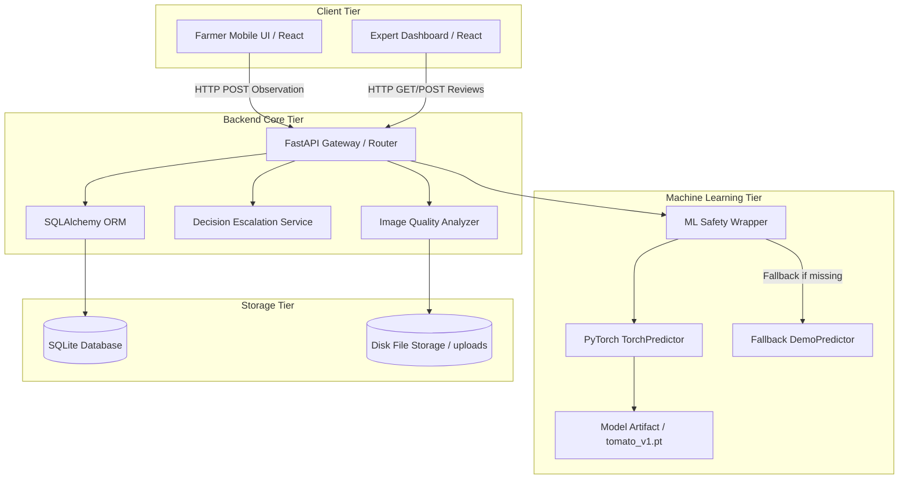
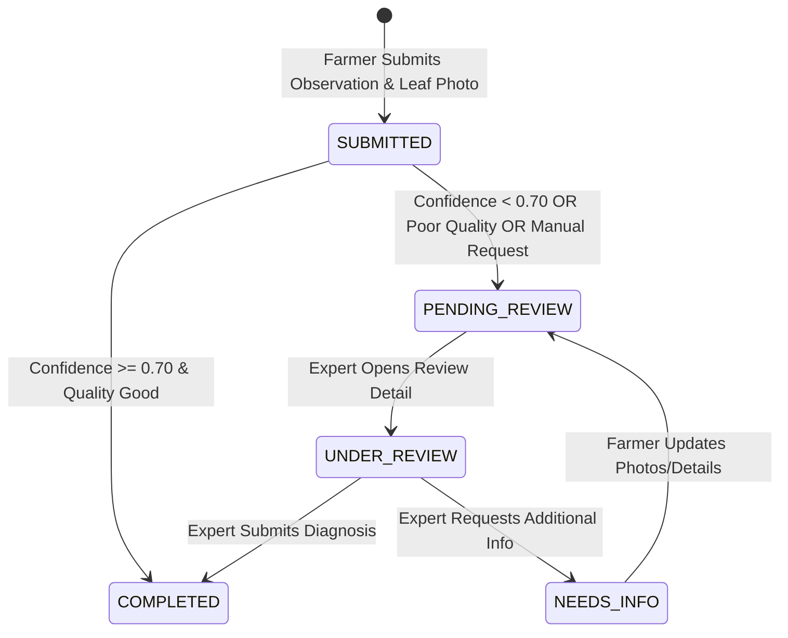

# HortiSentry — System Architecture & Data Flow

**Project Name:** HortiSentry  
**Full Title:** HortiSentry — AI-Powered Horticultural Disease Observation and Expert Escalation System  
**Tagline:** See Early. Act Smart. Protect Crops.  

---

## 1. Executive System Overview

HortiSentry is structured as a modular 3-tier web architecture designed for reliable agricultural observation collection, real-time computer vision inference, decision escalation, and human-in-the-loop expert review.

---

## 2. Component Specifications

### 2.1 Client Tier (React 18 + Vite + TypeScript)
- **Farmer Mobile UI:** Single-page mobile-first application guiding farmers through crop selection, leaf photo capture, image quality pre-check, symptom selection, and AI observation tracking.
- **Expert Dashboard:** Desktop reviewer portal providing cooperative agronomists with review queues, inspection tools, high-resolution image viewers, AI breakdown visualizations, and decision override/info-request controls.

### 2.2 Backend Core Tier (FastAPI + Pydantic)
- **FastAPI Core (`backend/app/main.py`):** Asynchronous REST service serving crop metadata, observation submission endpoints, expert review workflows, and system health status.
- **Image Quality Engine (`backend/app/services/image_quality_service.py`):** Analyzes uploaded leaf imagery using OpenCV for blur variance (Laplacian transform), exposure thresholds, minimum resolution ($224 \times 224$), and aspect ratios.
- **Decision Escalation Engine (`backend/app/services/escalation_service.py`):** Automatically routes observations to the expert review queue if:
  1. AI prediction confidence $< 0.70$ (`LOW_CONFIDENCE`).
  2. Image quality is flagged (`POOR_IMAGE_QUALITY`).
  3. Farmer explicitly requests expert assistance (`MANUAL_FARMER_REQUEST`).

### 2.3 Machine Learning Tier (PyTorch MobileNetV3 Small)
- **ML Safety Wrapper (`backend/app/ml/predictor.py`):** Dynamic loader managing real PyTorch model execution vs fallback demo mode based on `ML_MODE` configuration and model artifact availability.
- **TorchPredictor (`backend/app/ml/torch_predictor.py`):** Loads `ml/artifacts/tomato_v1.pt` model weights, executing deterministic preprocessing and softmax classification.

### 2.4 Data Tier (SQLAlchemy + SQLite)
- **SQLAlchemy Models (`backend/app/models/models.py`):** Relational schema preserving raw observations, image paths, AI predictions, escalation reasons, and authoritative expert review overrides in distinct database tables.

---

## 3. Observation Status Lifecycle State Machine

---

## 4. Security & Data Protection Architecture

1. **Path Traversal Protection:** Image upload filenames are sanitized using UUID generation (`uuid4()`), stripping path separators to prevent arbitrary directory write vulnerabilities.
2. **File Validation:** Uploads are checked against maximum file size limits ($10\text{MB}$), allowed extension lists (`.jpg`, `.jpeg`, `.png`, `.webp`), and PIL MIME header validation.
3. **Database Decision Isolation:** Original AI predictions and Expert review decisions are stored in separate database tables (`predictions` vs `expert_reviews`), ensuring expert overrides never alter historical AI inference data.
