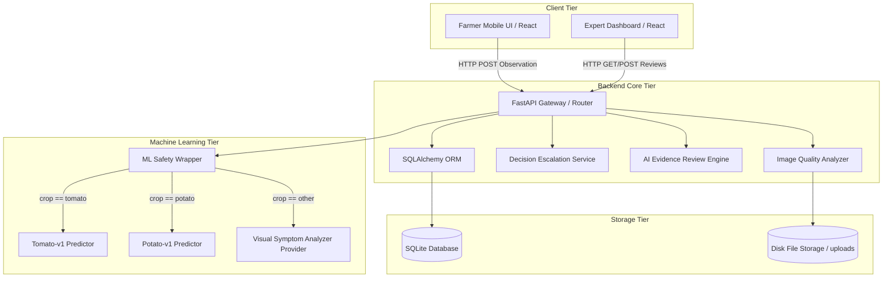
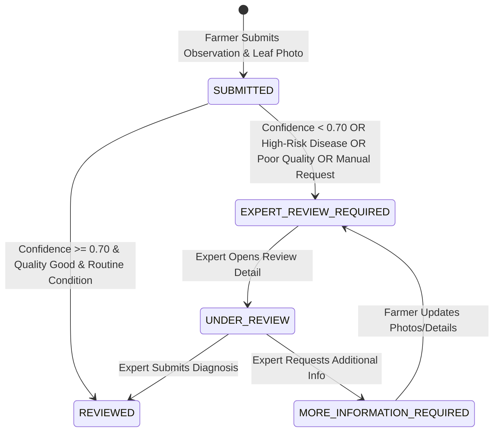

# HortiSentry — System Architecture & Data Flow

**Project Name:** HortiSentry  
**Full Title:** HortiSentry — AI-Powered Horticultural Disease Observation and Expert Escalation System  
**Tagline:** See Early. Act Smart. Protect Crops.  

---

## 1. Executive System Overview

HortiSentry is structured as a modular 3-tier web architecture designed for reliable agricultural observation collection, real-time computer vision inference, decision escalation, grounded evidence retrieval, and human-in-the-loop expert review.

---

## 2. Component Specifications

### 2.1 Client Tier (React 18 + Vite + TypeScript)
- **Farmer Mobile UI:** Single-page mobile-first application guiding farmers through crop selection, leaf photo capture, image quality pre-check, symptom selection, and AI observation tracking.
- **Expert Dashboard:** Desktop reviewer portal providing cooperative agronomists with review queues, inspection tools, high-resolution image viewers, AI breakdown visualizations, and decision override/info-request controls.

### 2.2 Backend Core Tier (FastAPI + Pydantic)
- **FastAPI Core (`backend/app/main.py`):** Asynchronous REST service serving multi-crop metadata, observation submission endpoints, expert review workflows, and system health status.
- **Image Quality Engine (`backend/app/services/image_quality_service.py`):** Analyzes uploaded leaf imagery using OpenCV for blur variance (Laplacian transform), exposure thresholds, minimum resolution ($224 \times 224$), and aspect ratios.
- **Decision Escalation Engine (`backend/app/services/escalation_service.py`):** Automatically routes observations to the expert review queue if:
  1. AI prediction confidence $< 0.70$ (`LOW_CONFIDENCE`).
  2. Image quality is flagged (`POOR_IMAGE_QUALITY`).
  3. High-risk disease is detected (`HIGH_RISK_CONDITION`, e.g. Late Blight).
  4. Farmer explicitly requests expert assistance (`MANUAL_FARMER_REQUEST`).
- **AI Evidence Review Engine (`backend/app/services/evidence_engine.py`):** Fuses visual predictions with grounded agricultural evidence from ICAR and TNAU Agritech portals, delivering structured management guidance and source citations.

### 2.3 Machine Learning Tier (Multi-Crop MobileNetV3 Small)
- **ML Safety Wrapper (`backend/app/ml/predictor.py`):** Dynamic router managing crop-specific PyTorch vision providers (`tomato-v1`, `potato-v1`) and falling back to visual assessment for unsupported crops.
- **TorchPredictors (`backend/app/ml/torch_predictor.py`):** Loads production artifacts (`ml/artifacts/tomato_v1.pt`, `ml/artifacts/potato_v1.pt`), executing deterministic preprocessing and softmax classification.

### 2.4 Data Tier (SQLAlchemy + SQLite)
- **SQLAlchemy Models (`backend/app/models/models.py`):** Relational schema preserving raw observations, image paths, AI predictions, escalation reasons, AI evidence reviews, and authoritative expert review overrides in distinct database tables.

---

## 3. Observation Status Lifecycle State Machine

---

## 4. Stakeholder Trade-Off Architecture Alignment

HortiSentry balances competing priorities across stakeholders:
1. **Farmer Acceptance vs Cooperative Quality Assurance:** Simple 2-minute submission wizard + automated background metadata collection.
2. **Fast Reporting vs Detailed Data Collection:** Visual leaf photo + symptom checkboxes enriched automatically by grounded ICAR/TNAU evidence retrieval.
3. **High Sensitivity vs Expert Workload:** 0.70 engineering confidence threshold filters out high-confidence routine cases while escalating high-risk pathogens (*Late Blight*).
4. **Automated AI Screening vs Human Verification:** AI acts strictly as advisory decision support; human agronomists retain binding review authority.
