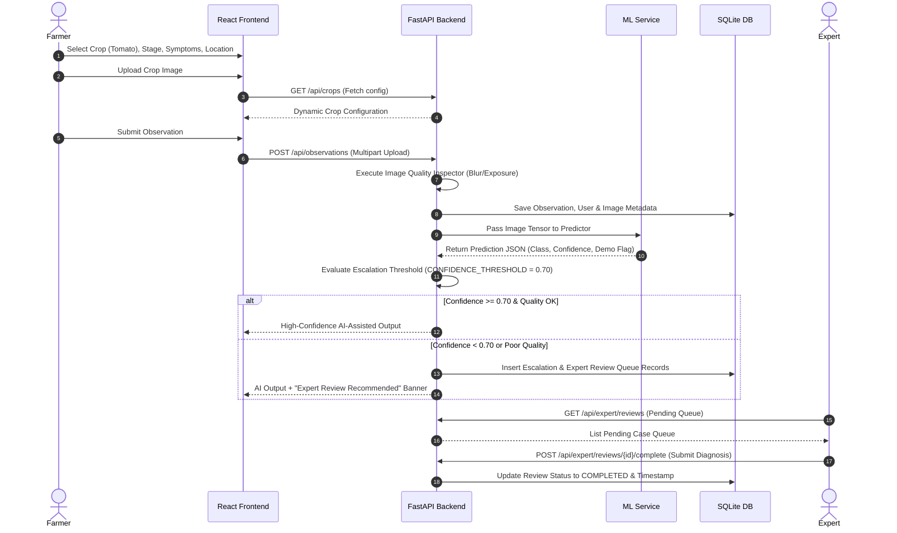

# HortiSentry — Data Flow Specification

## Overview
This document describes the end-to-end data lifecycle within HortiSentry, detailing how information moves from farmer input through backend validation, ML inference, decision-engine escalation, and expert resolution.

---

## High-Level Sequence Diagram

---

## Timestamps & Temporal Performance Metrics

HortiSentry explicitly records timestamps at each operational milestone to measure turnaround efficiency:

1. `symptom_observed_at`: Time when farmer first observed symptoms in the field.
2. `submitted_at`: Time when observation payload was submitted to FastAPI.
3. `started_at`: Time when an expert opened and initiated review of an escalated case.
4. `completed_at`: Time when expert saved authoritative guidance and closed the case.

**Primary Operational Performance Metric:**
$$\text{Time to Useful Review} = t_{\text{completed\_at}} - t_{\text{symptom\_observed\_at}}$$
