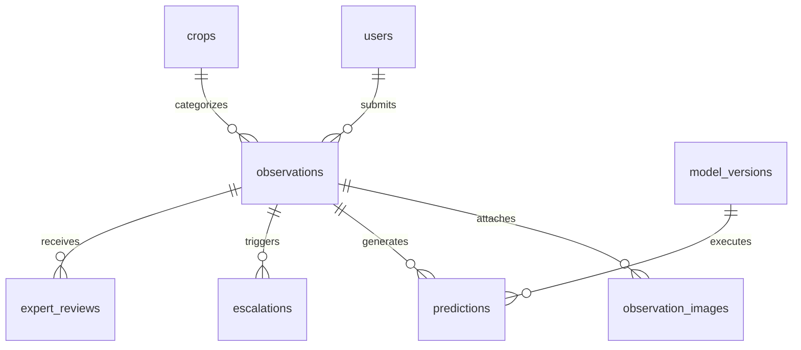

# HortiSentry — Database Schema & Data Dictionary

**Storage Engine:** SQLite (Academic MVP) / PostgreSQL Ready  
**ORM Framework:** SQLAlchemy 2.0  
**ID Generation Standard:** String UUID (UUIDv4)  

---

## Entity Relationship Overview

---

## Table Specifications

### 1. `users`
Stores system accounts for farmers, agricultural experts, and administrators.
- `id` (String UUID, Primary Key): Unique user identifier.
- `role` (String, Not Null): `FARMER`, `EXPERT`, or `ADMIN`.
- `name` (String, Not Null): Full name.
- `email` (String, Unique, Nullable): Account email address.
- `created_at` (DateTime): Record creation timestamp.

### 2. `crops`
Stores dynamic crop definitions populated from `config/crops.yaml`.
- `id` (String UUID, Primary Key): Unique crop record identifier.
- `key` (String, Unique, Not Null): Sluggified identifier (e.g. `tomato`).
- `display_name` (String, Not Null): Human-readable title (e.g. `Tomato`).
- `description` (Text): Extended crop description.
- `is_active` (Boolean, Default True): System activation flag.
- `created_at` (DateTime): Creation timestamp.

### 3. `observations`
Primary transaction table tracking farmer disease reports.
- `id` (String UUID, Primary Key): Unique observation ID.
- `user_id` (String, Foreign Key -> `users.id`): Submitting farmer identifier.
- `crop_id` (String, Foreign Key -> `crops.id`): Associated horticultural crop.
- `crop_stage` (String, Not Null): `SEEDLING`, `VEGETATIVE`, `FLOWERING`, `FRUITING`, `HARVEST`.
- `symptoms` (JSON, Not Null): List of observed symptom strings.
- `location_village` (String, Not Null): Non-identifying village name.
- `location_district` (String, Not Null): District location.
- `location_state` (String, Not Null): State location.
- `notes` (Text): Optional free-text farmer notes.
- `symptom_observed_at` (DateTime): Farmer reported symptom onset time.
- `submitted_at` (DateTime): API submission timestamp.
- `status` (String): `SUBMITTED`, `PENDING_REVIEW`, `UNDER_REVIEW`, `REVIEWED`, `COMPLETED`.

### 4. `observation_images`
Image media files attached to an observation.
- `id` (String UUID, Primary Key): Image record ID.
- `observation_id` (String, Foreign Key -> `observations.id`): Parent observation.
- `image_path` (String, Not Null): Local storage file path.
- `file_name` (String, Not Null): Original filename.
- `file_size_bytes` (Integer): Storage size in bytes.
- `is_blur_detected` (Boolean, Default False): Image quality warning flag.
- `blur_score` (Float): OpenCV Laplacian variance score.

### 5. `predictions`
AI model execution records per observation.
- `id` (String UUID, Primary Key): Prediction record ID.
- `observation_id` (String, Foreign Key -> `observations.id`): Associated observation.
- `model_version_id` (String, Foreign Key -> `model_versions.id`): Executed model version.
- `predicted_class` (String, Not Null): Top disease classification label.
- `confidence` (Float, Not Null): Score between 0.0 and 1.0.
- `top_predictions` (JSON, Not Null): Ranked list of predicted classes and confidence scores.
- `inference_time_ms` (Float): Execution duration in milliseconds.
- `is_demo_mode` (Boolean, Default True): True if generated by DemoPredictor.

### 6. `escalations`
Queue tracking records for human expert intervention.
- `id` (String UUID, Primary Key): Escalation ID.
- `observation_id` (String, Foreign Key -> `observations.id`): Escalated observation.
- `reason` (String, Not Null): `LOW_CONFIDENCE`, `POOR_IMAGE_QUALITY`, `MANUAL_FARMER_REQUEST`.
- `status` (String, Default `RECOMMENDED`): `RECOMMENDED`, `SUBMITTED`, `UNDER_REVIEW`, `RESOLVED`.
- `created_at` (DateTime): Escalation initiation timestamp.

### 7. `expert_reviews`
Ground-truth evaluations submitted by agricultural experts.
- `id` (String UUID, Primary Key): Review ID.
- `observation_id` (String, Foreign Key -> `observations.id`): Evaluated observation.
- `expert_id` (String, Foreign Key -> `users.id`): Reviewing expert.
- `expert_prediction` (String): Authoritative expert disease diagnosis.
- `expert_notes` (Text): Guidance notes provided by the expert.
- `review_status` (String): `PENDING`, `IN_PROGRESS`, `COMPLETED`, `NEEDS_INFO`.
- `started_at` (DateTime): Review start timestamp.
- `completed_at` (DateTime): Review resolution timestamp.

### 8. `model_versions`
Tracks deployed machine learning model weights metadata.
- `id` (String UUID, Primary Key): Model version ID.
- `version_name` (String, Unique, Not Null): e.g., `tomato-v1`.
- `model_architecture` (String): e.g., `MobileNetV3`.
- `is_active` (Boolean): Current active model flag.
