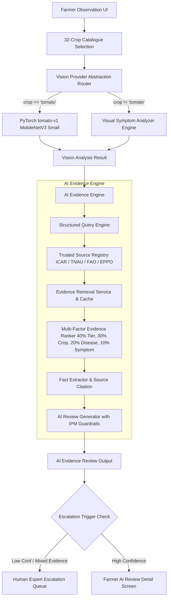

# HortiSentry Multi-Crop Platform Architecture

## Executive Overview
HortiSentry Phase 10 scales the system from a single-crop (Tomato) PyTorch disease classifier to an extensible 32-crop horticultural platform. The system leverages a dual-provider vision abstraction layer:
1. **Dedicated PyTorch Vision Model (`tomato-v1`)**: Highly accurate trained MobileNetV3 Small classifier for Tomato leaf diseases (99.37% test accuracy).
2. **Visual Symptom Analyzer Provider (`visual_assessment`)**: Generalizable multimodal AI vision analyzer operating across 31 additional horticultural crops (Vegetables, Fruits, Spices & Plantation).

## Architecture Diagram

## Crop Categories
- **Vegetables (10 crops)**: Tomato, Chilli, Brinjal, Potato, Onion, Garlic, Okra, Cabbage, Cauliflower, Cucumber.
- **Fruits (12 crops)**: Mango, Banana, Papaya, Citrus, Grapes, Guava, Pomegranate, Apple, Watermelon, Pineapple, Sapota, Strawberry.
- **Spices & Plantation (10 crops)**: Ginger, Turmeric, Black Pepper, Cardamom, Clove, Cinnamon, Coconut, Arecanut, Cashew, Coffee.
