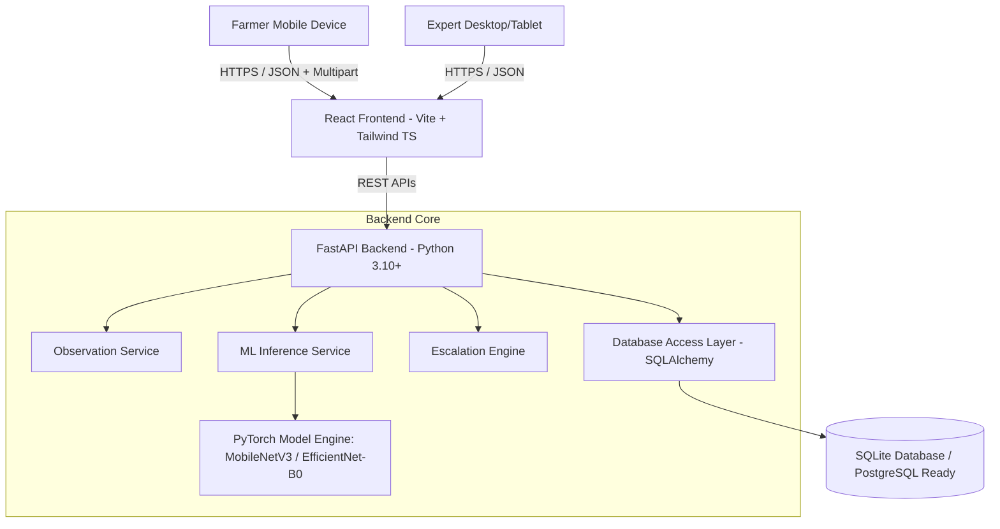
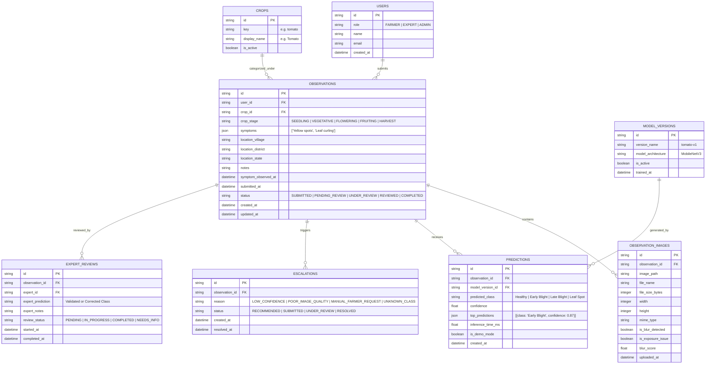

# HortiSentry — Phase 1: Planning & Architectural Specification

**Project Title:** HortiSentry — AI-Powered Horticultural Disease Observation and Expert Escalation System  
**Tagline:** See Early. Act Smart. Protect Crops.  
**Domain:** Horticulture + Artificial Intelligence + Machine Learning + Computer Vision + Farmer Support + Expert Review  
**Project Type:** College Academic Project / Functional MVP / Field-ready Prototype  

---

## 1. Requirement Analysis

### 1.1 Core Objectives
HortiSentry is designed as an AI-assisted observation and decision-support prototype. Its main goal is to reduce the operational turnaround time between early disease symptom observation by a farmer and actionable review by a human agricultural expert.

### 1.2 Non-Negotiable Medical/Agronomic Safeguards & Constraints
- **Assistance, Not Diagnostic Certification:** The platform is explicitly an AI-assisted observation tool and decision-support system. It must **never** claim to provide a guaranteed or authoritative diagnosis.
- **No Direct Treatment Recommendations:** The platform must **never** auto-generate or output chemical dosage/pesticide treatment recommendations directly based on AI predictions alone.
- **Uncertainty & Escalation:** All low-confidence or poor-quality observations are flagged and routed to a human expert. Farmers retain the ability to manually request expert review regardless of AI confidence.

### 1.3 Target Roles & Key User Requirements
- **Farmer Role (Mobile-First):**
  - Select horticultural crop (initial target: Tomato; extensible to Chilli, Brinjal, Potato, etc.).
  - Capture/upload clear photos of affected crop parts.
  - Receive immediate image quality validation feedback.
  - Select observed symptoms (e.g., yellow spots, brown spots, dark lesions, wilting, leaf curling, etc.).
  - Select crop growth stage (Seedling, Vegetative, Flowering, Fruiting, Harvest).
  - Provide non-identifying approximate location (Village, District, State).
  - Add optional text notes and submission timestamp tracking (`symptom_observed_at`).
  - View AI-assisted predictions, top alternative classes, and explicit confidence scores.
  - Trigger manual escalation to expert review and track case status.
- **Expert / Cooperative Reviewer Role (Desktop/Tablet Optimized):**
  - View queue of submitted observations with status filter (Pending, Under Review, Low Confidence, Reviewed).
  - Inspect crop image, visual quality status, metadata (stage, location, symptoms, timestamps).
  - Inspect AI prediction breakdown, confidence score, and model version.
  - Validate or correct AI prediction with authoritative expert diagnosis.
  - Provide expert notes/guidance or request additional information from the farmer.
  - Review historical cases to establish ground truth.

---

## 2. System Architecture

HortiSentry follows a clean, decoupled 3-tier micro-modular architecture:



### Architectural Key Principles:
1. **Decoupled Frontend & Backend:** Vite + React handles user interactions and client-side data buffering; FastAPI handles validation, API security, and routing.
2. **Pluggable ML Engine:** The ML service provides abstract model loading interfaces. Supports both **Demo Mode** (fallback rule-based/mock prediction when un-trained) and **Real Model Mode** (PyTorch evaluation).
3. **Escalation Engine:** Configurable confidence logic (`CONFIDENCE_THRESHOLD = 0.70`). Automatically flags low-confidence or poor image quality observations for expert queueing.

---

## 3. Technology Stack

| Layer | Technology | Justification |
| :--- | :--- | :--- |
| **Frontend Framework** | React 18+ (Vite) | Lightning-fast build tool, responsive modular UI development. |
| **Language (Frontend)** | TypeScript | Type safety across API models, component props, and state. |
| **Styling** | Vanilla CSS / Tailwind CSS | Custom horticulture design language, clean cards, touch targets. |
| **Icons & Design** | Lucide React | Accessible, crisp visual icon language (leaf, vision, shield). |
| **Backend API** | FastAPI (Python 3.10+) | High performance, async handlers, native OpenAPI / Swagger docs, Pydantic validation. |
| **ORM & Database** | SQLAlchemy + SQLite (Development) | Lightweight zero-config database for MVP; easily migration-ready for PostgreSQL. |
| **ML Engine** | PyTorch & Torchvision | Standard deep learning library for transfer learning with MobileNetV3 / EfficientNet-B0. |
| **Image Processing** | Pillow (PIL) + OpenCV/NumPy | Fast blur/brightness/contrast/resolution quality validation. |
| **Data Analysis** | pandas, scikit-learn, matplotlib | Evaluation scripts, metrics computation, confusion matrix generation. |
| **Testing** | pytest (Backend) / Vitest + React Testing Library (Frontend) | Automated unit and integration testing. |

---

## 4. Repository Folder Structure

```
HortiSentry/
├── frontend/                  # React + Vite + TypeScript Frontend
│   ├── src/
│   │   ├── components/        # Reusable UI components (Navbar, Cards, Badges, Image Quality Validator)
│   │   ├── pages/             # Farmer & Expert pages
│   │   │   ├── farmer/        # Home, NewObservation, AIResult, History, ObservationDetail
│   │   │   └── expert/        # Dashboard, PendingReviews, CaseDetail, ReviewHistory
│   │   ├── layouts/           # AppLayout, FarmerLayout, ExpertLayout
│   │   ├── hooks/             # Custom React hooks (useObservation, useAuth, useQualityCheck)
│   │   ├── services/          # API client modules (axios/fetch wrappers)
│   │   ├── types/             # TypeScript data models and interfaces
│   │   └── utils/             # Helper functions, formatters, constant definitions
│   ├── public/                # Static assets, placeholders, branding icons
│   ├── package.json
│   ├── vite.config.ts
│   └── tsconfig.json
│
├── backend/                   # Python FastAPI Backend
│   ├── app/
│   │   ├── api/               # API route controllers (health, observations, predict, expert, dashboard)
│   │   ├── models/            # SQLAlchemy database models
│   │   ├── schemas/           # Pydantic validation schemas
│   │   ├── services/          # Business logic (Observation, Escalation, Image Validation)
│   │   ├── ml/                # Model loader, predictor, preprocessor
│   │   ├── database/          # Session management, connection setup
│   │   ├── core/              # Config settings, security, constants
│   │   └── main.py            # FastAPI entry point
│   ├── tests/                 # Backend test suite (pytest)
│   └── requirements.txt       # Dependencies
│
├── ml/                        # Machine Learning Pipeline
│   ├── data/                  # Dataset storage pointers
│   ├── models/                # Saved trained model weights (.pt / .pth files)
│   ├── notebooks/             # Exploratory analysis notebooks
│   ├── scripts/               # Training, evaluation, export scripts
│   └── README.md
│
├── data/                      # Structured dataset directories
│   ├── raw/
│   ├── processed/
│   ├── train/
│   ├── validation/
│   └── test/
│
├── config/                    # Extensible dynamic configs
│   └── crops.yaml             # Dynamic dynamic definitions for crops, stages, symptoms, and disease classes
│
├── scripts/                   # Utility automation scripts (prepare_dataset.py, split_dataset.py)
├── reports/                   # Model performance reports, confusion matrices, metrics JSONs
├── docs/                      # Technical documentation & project artifacts
│   ├── phase-1-plan.md
│   ├── architecture.md
│   ├── data-schema.md
│   ├── data-flow.md
│   ├── stakeholder-tradeoff.md
│   ├── experiment-plan.md
│   ├── risk-register.md
│   ├── ethics.md
│   ├── environmental-impact.md
│   ├── maintenance.md
│   ├── user-guide.md
│   ├── limitations.md
│   └── requirements-traceability.md
├── .env.example
├── .gitignore
├── README.md
└── docker-compose.yml
```

---

## 5. Database Schema

The SQLite/SQLAlchemy schema consists of 8 normalized tables designed to capture the full observation-to-review lifecycle with exact temporal tracking.



---

## 6. API Design Specification

### 6.1 Health & Meta APIs
- `GET /api/health` -> System health status, database state, current active ML mode (DEMO / REAL).
- `GET /api/crops` -> Dynamically fetches configured crops, stages, symptoms, and target classes from `config/crops.yaml`.

### 6.2 Farmer Observation APIs
- `POST /api/observations` -> Uploads crop image + metadata (crop_id, stage, symptoms list, village, district, state, notes, `symptom_observed_at`). Runs image quality validation synchronously.
- `GET /api/observations` -> List farmer's submitted observations with filters.
- `GET /api/observations/{id}` -> Get detailed observation with image URL, quality metrics, predictions, and escalation status.
- `POST /api/predict` -> Evaluates observation image against PyTorch model (or Demo fallback Engine). Returns prediction details and confidence.

### 6.3 Escalation & Expert Review APIs
- `POST /api/observations/{id}/escalate` -> Manually or automatically request expert review with escalation reason.
- `GET /api/expert/dashboard/stats` -> Fetch expert dashboard KPIs (Total, Pending, Low Confidence, Reviewed cases).
- `GET /api/expert/reviews` -> Filterable queue of cases for agricultural experts.
- `GET /api/expert/reviews/{id}` -> Comprehensive case view for expert analysis.
- `POST /api/expert/reviews/{id}/complete` -> Expert submits ground-truth classification, comments, and marks case resolved.
- `POST /api/expert/reviews/{id}/request-info` -> Expert requests additional photo or details from farmer.

---

## 7. Frontend Interface Design

### 7.1 Key Farmer Interface Pages (Mobile-First)
1. **Home Screen:** Quick action card ("Report Crop Disease"), active observation status tracker, recent submission history.
2. **Crop Selection:** Visual crop grid (Tomato highlighted, expandable to others).
3. **Image Upload & Quality Inspector:** Native file selector / camera capture trigger. Instant visual feedback on image resolution, blur, and lighting before step progression.
4. **Symptom & Stage Picker:** High-contrast touch chips for symptoms (Yellow spots, Dark lesions, etc.) and stages (Seedling to Harvest).
5. **Location & Notes:** Non-identifying dropdowns (Village, District, State) + symptom start date picker + optional notes.
6. **Review & Submit:** Card summary of all input data before submission.
7. **AI Result View:** Clear breakdown of model outcome:
   - High Confidence: Green indicator, disease name, confidence %, disclaimer notice, optional "Request Expert Review" button.
   - Low Confidence / Quality Alert: Amber/Red indicator, "Expert Review Recommended" message, auto-escalation prompt.
8. **Observation History & Detail:** List view of historical submissions showing current escalation badge (`AI Result`, `Pending Expert Review`, `Expert Verified`).

### 7.2 Key Expert Dashboard Pages (Desktop/Tablet)
1. **Executive Dashboard:** Summary cards (Total Cases, Pending Reviews, Escalated Low Confidence, Completed Reviews).
2. **Case Queue Table:** Filterable by Crop, Status, Confidence (<70%), and Date Range.
3. **Case Detail & Decision Portal:** Side-by-side view of crop photo with pan/zoom, farmer reported symptoms, AI predictions, and expert validation panel (Validate / Override prediction, add expert notes, complete review).

---

## 8. Machine Learning Pipeline & Demo Strategy

```mermaid
flowchart LR
    A[Dataset Raw Images] --> B[Quality & Dimension Validation]
    B --> C[Data Split: Train 70% / Val 15% / Test 15%]
    C --> D[Data Augmentation: Flips, Rotation, ColorJitter]
    D --> E[Transfer Learning: PyTorch MobileNetV3 / EfficientNet-B0]
    E --> F[Validation & Hyperparameter Tuning]
    F --> G[Test Evaluation & Confusion Matrix Export]
    G --> H[Model Artifact Export: models/tomato_v1.pt]
    H --> I[Inference Engine Service]
```



### 8.1 Dual-Mode Operation Framework
- **DEMO MODE (Default Fallback):** When no trained PyTorch `.pt` file is present in `ml/models/`, the backend gracefully operates in DEMO MODE. It uses image features / heuristics to return mock predictions clearly labeled with `"is_demo_mode": true`. Front-end displays a visible **"DEMO MODE"** badge.
- **REAL MODEL MODE:** Activated automatically when `ml/models/tomato_v1.pt` is detected and loaded. Returns true PyTorch predictions and evaluation confidence scores.

### 8.2 Initial Tomato Target Classes
1. Healthy
2. Early Blight (*Alternaria solani*)
3. Late Blight (*Phytophthora infestans*)
4. Leaf Spot (*Septoria lycopersici*)

---

## 9. Dataset Strategy & Data Processing

- **Directory Structure:**
  - `data/raw/`: Original un-augmented crop images grouped by class.
  - `data/processed/`: Standardized $224 \times 224$ normalized RGB images.
  - `data/train/`, `data/validation/`, `data/test/`: Split datasets (70/15/15 ratio) preventing data leakage.
- **Data Preparation Scripts:** `scripts/prepare_dataset.py` handles image resizing, normalization using ImageNet means/stds (`mean=[0.485, 0.456, 0.406]`, `std=[0.229, 0.224, 0.225]`), and rejection of corrupted files.

---

## 10. Experimental Evaluation & Metrics Methodology

To guarantee scientific rigor for college evaluation:
- **Metrics Calculated:** Accuracy, Macro Precision, Macro Recall, Macro F1-Score, Per-Class Confusion Matrix, Average Inference Time (ms), Image Quality Rejection Rate, Escalation Rate.
- **Operational Efficiency Metric:**  
  $$\text{Time to Expert Review} = t_{\text{expert\_review\_completed}} - t_{\text{symptom\_observed}}$$
- **Unmeasured Metric Standard:** If actual training on large-scale datasets or human user testing has not been run, outputs in reports will explicitly state `"Pending experiment"` or `"Demo value — not an experimental result"`. No metrics will be fabricated.

---

## 11. Testing Strategy

- **Backend (pytest):**
  - Unit tests for API endpoints (`/api/health`, `/api/observations`, `/api/predict`).
  - Validation tests for invalid image uploads, oversized files, and missing fields.
  - Database persistence tests using SQLite in-memory instance.
- **ML Testing:**
  - Validation of preprocessor output shape ($3 \times 224 \times 224$).
  - Confidence threshold assertion tests (< 0.70 triggers escalation recommendation).
- **Frontend (Vitest & RTL):**
  - Component rendering tests for navigation, image validator, form state, and escalation alerts.
- **End-to-End Verification:**
  - Automated browser automation via subagent verifying full end-to-end user workflow: Crop Selection $\rightarrow$ Image Upload $\rightarrow$ Symptom Form $\rightarrow$ Submission $\rightarrow$ AI Result $\rightarrow$ Expert Escalation $\rightarrow$ Expert Verification.

---

## 12. Security Strategy

- **Environment Configuration:** Sensitive parameters stored in `.env` (with `.env.example` committed).
- **File Upload Security:**
  - Strict MIME-type checking (JPG, JPEG, PNG, WEBP).
  - Maximum file size limit (10MB).
  - File content header inspection via PIL.
  - Filename sanitization using UUIDs to prevent directory traversal attacks.
- **CORS Policies:** Configured FastAPI CORS middleware restricting allowed origin hosts.

---

## 13. Privacy & Data Minimization Strategy

- **Non-Identifying Location Capture:** Only coarse regional data (Village, District, State) is captured. No exact street addresses or home coordinates are stored.
- **No Sensitive PII Collected:** No requirement for Aadhaar, government ID numbers, or financial details.
- **Transparent Privacy Notice:** Displayed on the observation submission page informing farmers how crop photos and symptom notes are used strictly for disease observation and expert escalation.

---

## 14. Stakeholder Trade-Off Analysis

| Stakeholder Group | Primary Goals / Priorities | Potential Conflict | System Solution / Compromise |
| :--- | :--- | :--- | :--- |
| **Farmer** | Fast submission, minimal typing, low effort, instant visual guidance. | Prefers 1-step upload without filling lengthy diagnostic forms. | Streamlined mobile UI with pre-selectable tap chips for symptoms/stages and optional free text. |
| **Agricultural Expert** | Comprehensive symptom history, exact crop stage, high-quality images. | Requires rich contextual data to make accurate remote disease validations. | Mandatory crop stage & basic symptom selection combined with structured expert views showing all metadata alongside high-res photo. |

---

## 15. Risk Register

| Risk ID | Risk Description | Likelihood | Impact | Mitigation Strategy | Owner | Status |
| :--- | :--- | :--- | :--- | :--- | :--- | :--- |
| **R-01** | Poor image quality / blur leading to wrong AI prediction. | High | High | Automated client & server-side image quality check; flag low quality for expert escalation. | ML Engineer | Active |
| **R-02** | Misinterpretation of AI result as guaranteed diagnostic diagnosis. | Medium | Critical | Explicit disclaimers in UI; strict prohibition of pesticide dosage advice; highlight assistance role. | UX Lead | Active |
| **R-03** | Model overfitting to training dataset lighting/backgrounds. | Medium | High | Robust data augmentation (color jitter, random crop/flip); human expert review override. | ML Engineer | Active |
| **R-04** | Farmer connectivity loss in rural areas during submission. | High | Medium | Local caching of form state; offline warning; future offline queueing scope. | Frontend Dev | Planned |

---

## 16. Development Plan & Implementation Phases

- **Phase 1 (Current):** Requirement analysis, System Architecture, Tech Stack, & Documentation Specs.
- **Phase 2:** Repository initialization, dynamic configuration setup (`crops.yaml`), base FastAPI server, SQLite ORM database initialization.
- **Phase 3:** Backend core services (Observation creation, Image upload, Escalation engine, API routes).
- **Phase 4:** Farmer Mobile-First UI (Home, Observation wizard, AI Result, History).
- **Phase 5:** Expert Dashboard UI (KPIs, Pending queue, Case verification panel).
- **Phase 6:** Image quality validator & processing algorithms.
- **Phase 7:** ML Pipeline & Model Transfer Learning (PyTorch setup, Demo Mode engine fallback).
- **Phase 8:** Comprehensive test suite (Backend `pytest`, Frontend `Vitest`, browser validation).
- **Phase 9:** Project documentation, evaluation reports, and viva presentation materials.

---

## 17. Deployment Strategy

- **Containerization:** `docker-compose.yml` orchestrating FastAPI backend and React static build served via Nginx/Vite.
- **Academic Live Demo Setup:** Local dual-process launch script (`scripts/run_dev.py` or simultaneous terminal execution of FastAPI backend on port 8000 and React Vite on port 5173).

---

## 18. Known Assumptions

1. The initial prototype focuses on Tomato crop disease observation, but database and dynamic configuration models support multi-crop extensions without schema rewrites.
2. Farmers have smartphone devices with camera capabilities and modern web browser support.
3. Agricultural experts log into a web dashboard to review queued escalation cases.

---

## 19. Known Limitations

1. HortiSentry provides AI decision support and expert escalation; it is not a licensed agricultural diagnostic system.
2. Initial release relies on synthetic or publicly available tomato disease benchmark datasets (e.g., PlantVillage benchmark sub-samples) until local cooperative dataset collection is complete.
3. Offline data sync is noted in Future Scope and not fully active in initial MVP release.
